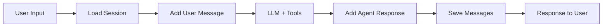

# MCP Session Management Integration

Complete integration of Model Context Protocol (MCP) with LangGraph agents for session management.

## 🚀 Architecture Overview

### Hybrid LangGraph Architecture
- **StateGraph Nodes**: Reliable session lifecycle management
- **LangGraph Tools**: LLM-driven business operations
- **MCP SDK**: Standard protocol for client-server communication

### Components

#### 1. MCP Server (`mcp/session/`)
- **Standard MCP SDK Server** with Streamable HTTP transport
- **Supports**: stdio (local) + HTTP (production)
- **Tools**: `session.get`, `session.create`, `session.patch`, `session.append_messages`, `session.touch`
- **Storage**: Redis with 2-hour TTL

#### 2. MCP Client (`agent/src/services/`)
- **Standard MCP SDK Client** with error handling and retries
- **Transport**: Streamable HTTP (Lambda-compatible)
- **Features**: Auto-reconnection, exponential backoff, timeout handling

#### 3. LangGraph Integration (`agent/src/services/langgraph-session-tools.ts`)
- **SessionStateManager**: StateGraph nodes for session lifecycle
- **Business Tools**: LangGraph tools for customer service operations
- **Hybrid Workflow**: Combines reliability + intelligence

## 📦 Installation & Setup

### Server Setup
```bash
cd mcp/session
npm install
npm run build

# Development (stdio)
MCP_TRANSPORT=stdio npm start

# Production (HTTP)
MCP_TRANSPORT=http PORT=3000 npm start
```

### Environment Variables
```bash
# MCP Server
MCP_TRANSPORT=http        # 'stdio' or 'http'
PORT=3000                 # HTTP port
REDIS_HOST=localhost      # Redis connection
REDIS_PORT=6379
REDIS_PASSWORD=           # Optional
REDIS_DB=0

# Agent Client
MCP_SESSION_URL=http://localhost:3000
```

## 🔧 Usage Examples

### 1. Simple Agent (Basic)
```typescript
import { DispatchAgent } from './agent';

const agent = new DispatchAgent({
  transport: 'http',
  serverUrl: 'http://your-mcp-server:3000'
});

const response = await agent.processRequest({
  callSid: 'call-123',
  text: 'Hello, I need to book an appointment'
});
```

### 2. LangGraph Workflow (Recommended)
```typescript
import { createSessionAgent } from './examples/langgraph-session-example';

const { graph } = createSessionAgent();

const result = await graph.invoke({
  callSid: 'call-456',
  userInput: 'Hi, I need a haircut appointment'
});

console.log('Agent Response:', result.agentResponse);
```

### 3. Custom StateGraph Integration
```typescript
import { StateGraph, END } from "@langchain/langgraph";
import { createLangGraphSessionIntegration } from './services/langgraph-session-tools';

const { stateManager, businessTools } = createLangGraphSessionIntegration();

const workflow = new StateGraph<SessionAgentState>({...})
  .addNode("load_session", stateManager.loadSession.bind(stateManager))
  .addNode("agent", createReactAgent({
    llm,
    tools: Object.values(businessTools)
  }))
  .addNode("save_messages", stateManager.saveMessages.bind(stateManager));
```

## 🛠️ Available Tools

### State Management (StateGraph Nodes)
- `loadSession(state)` - Load/create session with auto-retry
- `saveMessages(state)` - Persist conversation history
- `addUserMessage(state, message)` - Add customer message
- `addAgentMessage(state, message)` - Add AI response

### Business Operations (LangGraph Tools)
- `update_user_info` - Store customer details (name, phone, address)
- `select_service` - Choose from available services
- `schedule_time` - Set appointment time
- `complete_booking` - Finalize the booking
- `get_session_info` - Check current booking status

## 🔄 Session Lifecycle



## 🚨 Error Handling

### Client-Side (Auto-handled)
- **Connection failures**: Auto-reconnection with exponential backoff
- **Timeouts**: 30-second timeout with 3 retries
- **Network errors**: Automatic retry with connection reset
- **Invalid responses**: Graceful error parsing and fallbacks

### Server-Side
- **Redis failures**: Proper MCP error codes and logging
- **Invalid parameters**: Schema validation with detailed errors
- **Session not found**: Auto-creation for get operations

## 🔧 Deployment

### Docker (Recommended)
```dockerfile
# MCP Server
FROM node:18-alpine
COPY mcp/session ./
RUN npm install && npm run build
EXPOSE 3000
CMD ["npm", "start"]
```

### ECS/Fargate
```yaml
# task-definition.json
{
  "family": "mcp-session-server",
  "containerDefinitions": [{
    "name": "server",
    "image": "your-repo/mcp-session:latest",
    "environment": [
      {"name": "MCP_TRANSPORT", "value": "http"},
      {"name": "PORT", "value": "3000"},
      {"name": "REDIS_HOST", "value": "your-redis.cache.amazonaws.com"}
    ],
    "portMappings": [{"containerPort": 3000}]
  }]
}
```

### Lambda Agent
```typescript
// Lambda environment variables
process.env.MCP_SESSION_URL = 'https://your-mcp-server.com';

// In your Lambda function
import { createSessionAgent } from './langgraph-session-example';

export const handler = async (event: any) => {
  const { graph, stateManager } = createSessionAgent();

  try {
    const result = await graph.invoke({
      callSid: event.callSid,
      userInput: event.userMessage
    });

    return {
      statusCode: 200,
      body: JSON.stringify({ response: result.agentResponse })
    };
  } finally {
    await stateManager.close();
  }
};
```

## 🧪 Testing

### Local Development
```bash
# Terminal 1: Start MCP Server
cd mcp/session
MCP_TRANSPORT=http npm start

# Terminal 2: Test client
cd agent
npm run test:langgraph
```

### Health Checks
```typescript
import { MCPSessionClient } from './services/mcp-session-client';

const client = new MCPSessionClient({ transport: 'http' });
const isHealthy = await client.healthCheck();
console.log('MCP Server Health:', isHealthy);
```

## 📈 Performance & Scaling

### Client Performance
- **Connection pooling**: Reuse connections across requests
- **Retry logic**: Exponential backoff prevents thundering herd
- **Timeout handling**: 30s timeout prevents hanging Lambda functions

### Server Performance
- **Redis clustering**: For high availability
- **Horizontal scaling**: Multiple server instances behind load balancer
- **Session TTL**: 2-hour automatic cleanup

### Lambda Optimizations
- **Connection reuse**: Keep MCP client in global scope
- **Graceful shutdown**: Always call `client.close()` in finally blocks
- **Cold start**: First connection may take longer

## 🔒 Security Considerations

- **Network**: Use HTTPS in production
- **Authentication**: Implement API keys or JWT tokens
- **Redis**: Use Redis AUTH and TLS
- **Session isolation**: Each callSid is completely isolated
- **Input validation**: All tool parameters are validated

## 📊 Monitoring & Logging

### Server Logs
```
MCP Session Server running on HTTP port 3000
Loading session for callSid: call-123
Saved 2 messages for call-123
Redis connection established
```

### Client Logs
```
MCP client connected via http
MCP call attempt 1/3 failed: timeout
Session loaded successfully
```

### Metrics to Track
- Session creation rate
- Average session duration
- Tool usage frequency
- Error rates by type
- Redis performance

## 🚀 What's Next

This implementation provides a robust foundation for:
- **Multi-tenant support**: Add company/user isolation
- **Advanced workflows**: Complex booking scenarios
- **Analytics**: Session analytics and reporting
- **Integrations**: Calendar systems, payment processing
- **Scaling**: Microservices architecture

The hybrid LangGraph + MCP architecture ensures both reliability and intelligence for production AI agents.